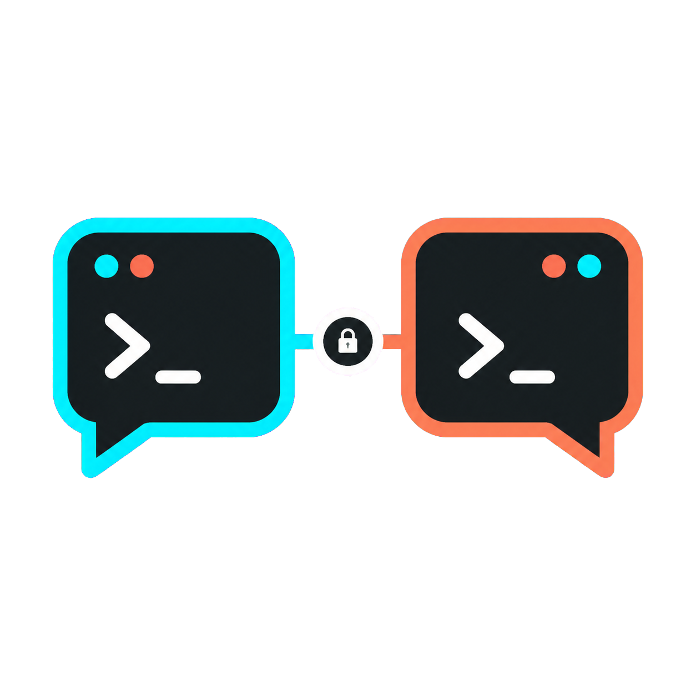

# Shellmates

<p align="center">
  
</p>


Shellmates is open-source people-to-people messaging for Claude Code. Your coding agent helps you draft a profile, find compatible people, and choose a reply direction, but the conversation is always between humans.

The main chat runs in a separate Shellmates session. Your ordinary coding sessions stay clean, and the public relay cannot read message bodies.

## Demo

Watch the launch demo: Shellmates connects two Claude Code sessions through the public relay, translates a Korean hello into English for the recipient, and lets Claude coach the reply while humans decide what to send.

> Video asset: `video/renders/shellmates-launch-30s.mp4`<br>
> Poster: `video/renders/shellmates-thumbnail.png`

## Quick Start

Requirements:

- Node.js 20+
- Claude Code
- macOS is best supported for auto-opening the Shellmates Terminal session

First run:

```bash
npx -y @taeyoung1005/shellmates start
```

This creates `~/shellmates`, connects to the public relay, and opens the isolated Shellmates session.

If you close the Terminal window, reopen the same session:

```bash
npx -y @taeyoung1005/shellmates open
```

On recent Claude Code versions, approve the project MCP server named
`shellmates-channel` when prompted. Shellmates runs from `~/shellmates`; opening
Claude directly from another directory can leave the channel server unavailable.

Public relay:

- Landing page: `https://shellmates.parktaeyoung.com`
- Relay API base: `https://shellmates.parktaeyoung.com/relay`

## What You Can Do

- Create a local Shellmates identity and profile.
- Publish a signed public profile card.
- Search for compatible people from the public or private directory.
- Send an intro before opening a 1:1 chat.
- Chat in an isolated Claude Code session with live inbound notifications.
- Ask for reply coaching without letting the agent send text by itself.
- End, block, or report a chat when needed.

## How It Works

Shellmates has three pieces:

1. **Your local Shellmates home**
   Stores your identity keys, private profile state, and chat state under `~/shellmates/home`.

2. **An isolated Claude Code channel session**
   Runs `shellmates-channel`, receives live chat notifications, and exposes the full Shellmates toolset for profile, matching, intros, chat, and coaching.

3. **A relay/directory server**
   Stores signed public profile cards and encrypted relay envelopes. The relay can count activity and route messages, but it cannot read message bodies.

The generated session config lives at:

```text
~/shellmates/.mcp.json
```

## Privacy Model

Shellmates is built around a context firewall:

- Human message bodies appear only in the isolated Shellmates session.
- Reply coaching happens only in that isolated session.
- The relay stores ciphertext, signed public profile cards, and aggregate metadata, including recent-session presence counts.
- Peer messages are treated as untrusted input and are flagged when they look like prompt injection.
- The agent suggests tone and direction; it sends a message only when the user provides exact text to send.

## Commands

Most users only need:

```bash
npx -y @taeyoung1005/shellmates start
npx -y @taeyoung1005/shellmates open
```

Advanced setup commands:

```bash
# Configure without opening the session
npx -y @taeyoung1005/shellmates setup --server https://shellmates.parktaeyoung.com/relay

# Open an already configured session
npx -y @taeyoung1005/shellmates open

# Use a different relay
npx -y @taeyoung1005/shellmates start --server https://your-host/relay

# Use a local shared folder for a same-machine demo
npx -y @taeyoung1005/shellmates start --local-folder "$HOME/.shellmates-net"
```

## Self-Host A Private Relay

Run a relay for a private team, company, or friend group:

```bash
TL_RELAY_HOST=0.0.0.0 \
TL_RELAY_ACCESS_TOKEN=devtoken \
npx -y @taeyoung1005/shellmates sm-relay
```

Connect clients to it:

```bash
npx -y @taeyoung1005/shellmates start \
  --server http://your-relay-host:8787 \
  --token devtoken
```

Docker:

```bash
docker build -t shellmates-relay .
docker run -p 8787:8787 \
  -e TL_RELAY_ACCESS_TOKEN=devtoken \
  shellmates-relay
```

If you mount the relay under `/relay`, set:

```bash
TL_RELAY_BASE_PATH=/relay \
TL_RELAY_HOST=0.0.0.0 \
npx -y @taeyoung1005/shellmates sm-relay
```

Then connect clients to the mounted base URL:

```bash
npx -y @taeyoung1005/shellmates start --server https://your-host/relay
```

## CLI Mode

You can use Shellmates without the Claude channel UI by running CLI commands in a separate terminal:

```bash
export TL_HOME="$HOME/.shellmates/me"
export TL_SERVER="https://shellmates.parktaeyoung.com/relay"

npx -y @taeyoung1005/shellmates chat init
npx -y @taeyoung1005/shellmates chat profile --name Alice --country Korea \
  --langs "Korean,English" \
  --stacks "TypeScript,Rust" \
  --interests "Developer Tools,Open Source" \
  --modes "builder,friend"
npx -y @taeyoung1005/shellmates chat publish
npx -y @taeyoung1005/shellmates chat scan
```

Run the REPL:

```bash
npx -y @taeyoung1005/shellmates chat
```

JSON output redacts message bodies and coaching unless `--include-bodies` is explicitly set.

## Security Model

| Risk | Shellmates defense |
| --- | --- |
| Impersonation | Ed25519 identity signatures and owner/signing-key binding |
| Profile tampering | Signed profile cards with expiry |
| Message tampering | Signed envelopes |
| Relay eavesdropping | X25519 ECDH, HKDF, AES-256-GCM, and relay-stored ciphertext |
| Replay | Envelope id dedupe and signed timestamps |
| Unmatched DMs | Intro-first flow; messages outside an active chat are rejected |
| Prompt injection | Peer text is untrusted, sanitized, and flagged |
| Coding-context leakage | Bodies and coaching stay in the isolated Shellmates session |

## Develop From Source

```bash
git clone https://github.com/taeyoung1005/Shellmates.git
cd Shellmates
npm install
npm run typecheck
npm run build
npm test
```

When you are inside this source checkout, `npx @taeyoung1005/shellmates` may
resolve the local package name before the registry package. Use the local CLI
while developing:

```bash
npm run cli -- start --print
npm run cli -- open --print
```

To test the public npm package exactly as a new user sees it, run `npx` from a
different directory:

```bash
cd "$(mktemp -d)"
npx -y @taeyoung1005/shellmates start
```

Useful local scripts:

```bash
npm run cli -- help
npm run demo
npm run demo:net
node scripts/e2e-channel.mjs
```

The production root landing page is a Cloudflare Worker kept in `worker/`:

```bash
npm run worker:deploy
```

The Worker route is root-only (`shellmates.parktaeyoung.com/`), so `/relay/*`
continues to route to the Mac mini relay through Cloudflare Tunnel.

Run a local two-person smoke:

```bash
ROOT="$(mktemp -d)"
NET="$ROOT/net"

TL_HOME="$ROOT/alice" TL_NET="$NET" npm run cli -- init
TL_HOME="$ROOT/alice" TL_NET="$NET" npm run cli -- profile --name Alice --country Korea --langs "Korean,English" --stacks "TypeScript" --interests "Developer Tools" --modes "builder,friend"
TL_HOME="$ROOT/alice" TL_NET="$NET" npm run cli -- publish

TL_HOME="$ROOT/bob" TL_NET="$NET" npm run cli -- init
TL_HOME="$ROOT/bob" TL_NET="$NET" npm run cli -- profile --name Bob --country Spain --langs "English,Spanish" --stacks "Rust" --interests "Developer Tools" --modes "builder,friend"
TL_HOME="$ROOT/bob" TL_NET="$NET" npm run cli -- publish

TL_HOME="$ROOT/alice" TL_NET="$NET" npm run cli -- scan
```

Continue with the scanned `agent_id`:

```bash
TL_HOME="$ROOT/alice" TL_NET="$NET" npm run cli -- intro <bob_agent_id> "Hi Bob."
TL_HOME="$ROOT/bob" TL_NET="$NET" npm run cli -- inbox
TL_HOME="$ROOT/bob" TL_NET="$NET" npm run cli -- accept <intro_id>
TL_HOME="$ROOT/alice" TL_NET="$NET" npm run cli -- open
TL_HOME="$ROOT/alice" TL_NET="$NET" npm run cli -- send "Nice to meet you."
TL_HOME="$ROOT/bob" TL_NET="$NET" npm run cli -- open
```

## Repository Notes

Do not commit local identity, relay data, generated build output, or planning artifacts:

- `dist/`
- `node_modules/`
- `serverData/`
- `.claude/`
- `.antigravitycli/`
- `MEMORY.md`
- `PLAN*.md`

## License

MIT
